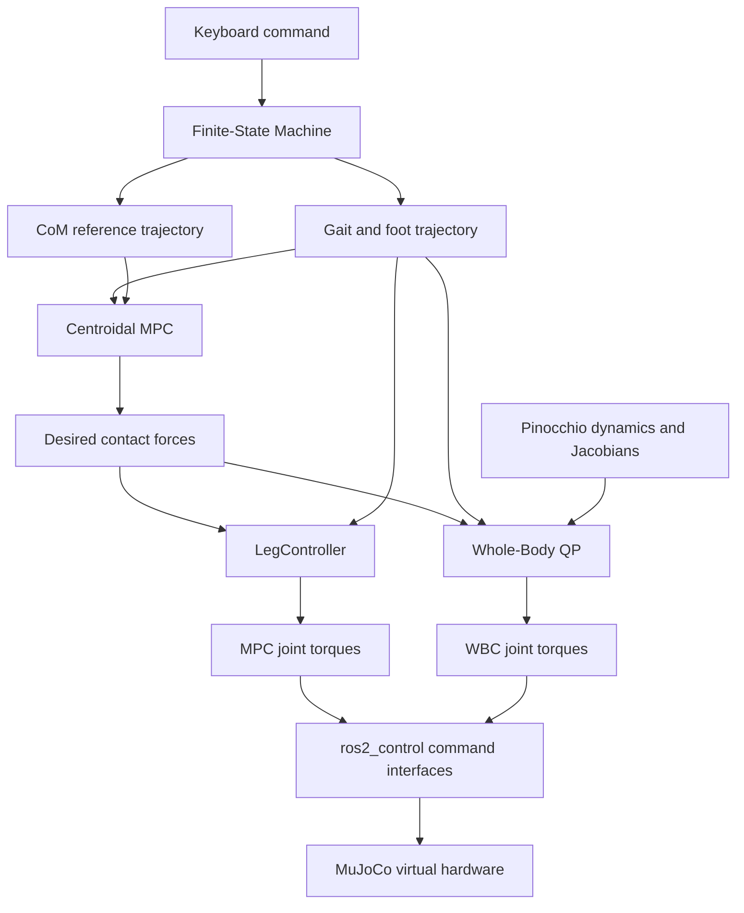

# quadruped_pkg

`quadruped_pkg` is a ROS 2 Humble quadruped-control project for the Unitree Go2 simulation. It combines a Go2 URDF/MuJoCo description, a MuJoCo-backed `ros2_control` hardware interface, Pinocchio-based kinematics and dynamics, centroidal MPC, and whole-body control.

The project provides two independent trotting pipelines:

- `MPC_TROTTING`: centroidal MPC followed by a Cartesian swing/stance leg controller.
- `MPC_WBC_TROTTING`: centroidal MPC followed by a whole-body QP controller.

The original MPC controller is preserved as a standalone baseline, allowing the two control architectures to be tested and compared in the same MuJoCo and `ros2_control` framework.

<table>
  <tr>
    <td align="center"><strong>RViz</strong></td>
    <td align="center"><strong>MuJoCo Simulation</strong></td>
  </tr>
  <tr>
    <td></td>
    <td></td>
  </tr>
</table>

<p align="center">
  <strong>MPC State, Force, and Torque Logs</strong><br/>
  
</p>

<p align="center">
  <strong>MPC Contact Forces</strong><br/>
  
</p>

## Packages

- `go2_description`: Go2 URDF/Xacro model, mesh assets, MuJoCo model assets, RViz config, and `ros2_control` hardware configuration.
- `quadruped_mujoco_hardware`: MuJoCo virtual hardware plugin for `ros2_control`, including joint states, actuator torques, IMU, foot-force interfaces, odometer state, and optional embedded viewer.
- `quadruped_controller`: Main `ros2_control` controller plugin. It includes the FSM states, Go2 Pinocchio model wrapper, gait and foot-trajectory generation, CoM reference generation, centroidal MPC, the original swing/stance leg controller, and the whole-body QP controller.
- `quadruped_controller_msgs`: Custom input message used by the keyboard command node.
- `keyboard_input`: Terminal keyboard node and scripted MPC command scheduler that publish `quadruped_controller_msgs/msg/Inputs` to `/control_input`.
- `third_party`: Local third-party solver dependencies used by the controller.

## Main Control States

- `PASSIVE`: Zero-torque safe state.
- `FIXEDSTAND`: Position-controlled transition to the nominal standing configuration.
- `FREESTAND`: Body pose adjustment using inverse kinematics.
- `MPC_TROTTING`: Original locomotion pipeline using `ComTrajectory + CentroidalMPC + LegController`.
- `MPC_WBC_TROTTING`: Experimental hierarchical locomotion pipeline using `ComTrajectory + CentroidalMPC + WbcController`.

## Controller Overview



The shared motion-control stack includes:

- **Centroidal MPC (~48 Hz)**  
  Contact-force-based centroidal MPC implemented in C++ with OSQP/OsqpEigen. It solves a convex QP over one gait-cycle prediction horizon, divided into 16 time steps, and outputs optimized ground reaction forces for each foot.

- **Reference Trajectory Generator (~48 Hz)**  
  Generates the desired CoM position, velocity, attitude, angular velocity, and foot-lever references for the MPC horizon from user body-frame velocity and yaw-rate commands.

- **Swing/Stance Leg Controller (500 Hz)**  
  This is the lower-level controller used by the original `MPC_TROTTING` state. Swing legs use Cartesian-space impedance control with feedforward swing acceleration and Pinocchio-based Jacobian dynamics. Stance legs map the optimized MPC contact forces into joint torques through the foot Jacobian.

- **Whole-Body Controller (500 Hz)**
  This is the lower-level controller used by `MPC_WBC_TROTTING`. It solves for floating-base acceleration, joint acceleration, and contact forces while enforcing whole-body dynamics, planned contact constraints, friction constraints, normal-force bounds, and joint-torque limits.

- **Gait Scheduler and Foot Trajectory Generator (500 Hz)**  
  Schedules swing/stance timing in `FL FR RL RR` leg order, computes touchdown positions using a Raibert-style foot-placement rule, and generates swing-foot trajectories with a quintic polynomial and adjustable apex height.

## MPC + Whole-Body Control

The MPC+WBC pipeline is implemented as an independent FSM state. It does not replace the runtime behavior of the original `MPC_TROTTING` state.

### WBC Decision Variables

The WBC solves a 30-dimensional quadratic program:

```text
z = [ddq(18), contact_forces(12)]
```

- `ddq` contains the 6 floating-base and 12 actuated-joint accelerations.
- `contact_forces` contains the three-dimensional world-frame contact force of each leg in `FL FR RL RR` order.

### WBC Soft Tasks

The WBC objective contains:

- desired floating-base acceleration tracking;
- swing-foot acceleration tracking;
- desired joint-acceleration tracking;
- MPC contact-force tracking;
- acceleration and contact-force regularization.

The MPC contact forces are references rather than final actuator commands. The WBC can redistribute them to satisfy whole-body dynamics and actuator constraints.

### WBC Hard Constraints

The QP enforces:

- floating-base rigid-body dynamics;
- zero acceleration of planned support feet;
- zero contact force for planned swing legs;
- a conservative linear friction pyramid;
- per-leg normal-force bounds;
- joint-torque limits.

MPC and WBC use the same planned contact mask generated by `Gait`. When the contact mask changes, MPC is updated immediately so that the current MPC force reference and WBC contact constraints remain synchronized.

### WBC Solver

The WBC uses OSQP through OsqpEigen. The sparse Hessian and constraint patterns are initialized once; subsequent control cycles update only matrix values, gradients, and bounds. Warm start is retained during continuous contact phases and reset when the discrete contact set changes.

A solution is accepted only when the solver succeeds and the dynamics, equality, and inequality residuals remain within the configured validation tolerance. The original `LegController` remains available as the fallback torque controller.

## Prerequisites

The project is developed for Ubuntu 22.04 and ROS 2 Humble.

Install common build tools and ROS dependencies:

```bash
sudo apt update
sudo apt install -y \
  git build-essential cmake \
  python3-colcon-common-extensions python3-rosdep \
  python3-numpy python3-matplotlib \
  libeigen3-dev libglfw3-dev libgl1-mesa-dev \
  ros-humble-ros2-control ros-humble-ros2-controllers \
  ros-humble-controller-manager \
  ros-humble-robot-state-publisher \
  ros-humble-joint-state-publisher \
  ros-humble-joint-state-publisher-gui \
  ros-humble-imu-sensor-broadcaster \
  ros-humble-xacro ros-humble-rviz2 \
  ros-humble-pinocchio ros-humble-kdl-parser
```

External libraries:

- Install the MuJoCo C/C++ library. The default CMake path is `/opt/mujoco`, and this directory should contain `include/mujoco/mujoco.h` and `lib/libmujoco.so`.
- `OSQP` and `OsqpEigen` are already provided in `third_party/`, so no extra system installation is required for them.

## Build

Clone this repository into a clean ROS 2 workspace:

```bash
mkdir -p ~/ros2_ws/src
cd ~/ros2_ws/src
git clone https://github.com/HongjianHu/quadruped_pkg.git

cd ~/ros2_ws
source /opt/ros/humble/setup.bash

# Run this once if rosdep has not been initialized on your machine:
# sudo rosdep init
rosdep update
rosdep install --from-paths src/quadruped_pkg --ignore-src -r -y

colcon build --symlink-install --packages-up-to quadruped_controller keyboard_input
source install/setup.bash
```

If MuJoCo is not installed at `/opt/mujoco`, build with:

```bash
colcon build --symlink-install \
  --packages-up-to quadruped_controller keyboard_input \
  --cmake-args -DMUJOCO_ROOT=/path/to/mujoco
```

## Run Simulation

Start the controller, MuJoCo hardware simulation, robot state publisher, broadcasters, and RViz:

```bash
cd ~/ros2_ws
source /opt/ros/humble/setup.bash
source install/setup.bash
ros2 launch quadruped_controller mujoco_control.launch.py use_rviz:=true
```

Useful launch arguments:

- `use_rviz:=true`: Start RViz with the Go2 model.
- `use_embedded_mujoco_viewer:=true`: Start the embedded MuJoCo viewer inside the hardware interface.
- `use_mujoco_viewer:=true`: Start the standalone MuJoCo `simulate` viewer for model inspection.
- `mujoco_scene:=scene.xml`: Select the MuJoCo scene file. Relative paths are resolved under `go2_description/mujoco/go2_unitree/`.

Example without RViz:

```bash
ros2 launch quadruped_controller mujoco_control.launch.py use_rviz:=false
```

Example on a flat ground scene:

```bash
ros2 launch quadruped_controller mujoco_control.launch.py \
  use_rviz:=false \
  use_embedded_mujoco_viewer:=true \
  mujoco_scene:=scene_flat.xml
```

## MPC Demo Recording and Plots

The MPC plots shown above are generated from a scripted flat-ground MuJoCo run. Start the flat scene first:

```bash
cd ~/ros2_ws
source /opt/ros/humble/setup.bash
source install/setup.bash
ros2 launch quadruped_controller mujoco_control.launch.py \
  use_rviz:=false \
  use_embedded_mujoco_viewer:=true \
  mujoco_scene:=scene_flat.xml
```

In a second terminal, record the debug topics to CSV:

```bash
cd ~/ros2_ws/src/quadruped_pkg
source /opt/ros/humble/setup.bash
source ~/ros2_ws/install/setup.bash
python3 scripts/record_mpc_debug_csv.py \
  --output-dir /tmp/quadruped_plot_data/scheduled_flat_demo \
  --duration 26.0 \
  --no-command
```

In a third terminal, publish the scripted MPC command sequence:

```bash
cd ~/ros2_ws
source /opt/ros/humble/setup.bash
source install/setup.bash
ros2 run keyboard_input mpc_command_scheduler --ros-args \
  -p fixedstand_duration:=5.0 \
  -p speed_scale:=1.0
```

Then generate the figures:

```bash
cd ~/ros2_ws/src/quadruped_pkg
python3 scripts/plot_mpc_metrics.py \
  --csv /tmp/quadruped_plot_data/scheduled_flat_demo/estimator_debug.csv \
  --joint-csv /tmp/quadruped_plot_data/scheduled_flat_demo/joint_states.csv \
  --out-dir .images/mpc_metrics_flat_demo \
  --start 4.5 \
  --end 23.0 \
  --ref-height 0.27
```

The scripted demo includes forward walking, lateral motion, yaw rotation, combined forward turning, and a faster forward segment. The normalized forward command currently maps to a maximum reference of `1.00 m/s`; this command limit should not be interpreted as a validated stable speed for every controller configuration.

## Keyboard Control

Run the keyboard node in another terminal:

```bash
cd ~/ros2_ws
source /opt/ros/humble/setup.bash
source install/setup.bash
ros2 run keyboard_input keyboard_input
```

Keep this terminal focused, because it reads directly from stdin.

<table>
  <tr>
    <th>Mode keys</th>
    <th>FreeStand keys</th>
    <th>MPC keys</th>
  </tr>
  <tr>
    <td>
      <code>1</code>: <code>PASSIVE</code><br/>
      <code>2</code>: <code>FIXEDSTAND</code><br/>
      <code>4</code>: <code>FREESTAND</code><br/>
      <code>6</code>: <code>MPC_TROTTING</code><br/>
      <code>7</code>: <code>MPC_WBC_TROTTING</code>
    </td>
    <td>
      <code>A</code> / <code>D</code>: roll<br/>
      <code>W</code> / <code>S</code>: pitch<br/>
      <code>J</code> / <code>L</code>: yaw<br/>
      <code>I</code> / <code>K</code>: body height<br/>
      <code>Space</code>: reset command axes
    </td>
    <td>
      <code>A</code> / <code>D</code>: desired body-frame <code>lx</code><br/>
      <code>W</code> / <code>S</code>: desired body-frame <code>ly</code><br/>
      <code>J</code> / <code>L</code>: desired yaw rate<br/>
      <code>I</code> / <code>K</code>: desired body height<br/>
      <code>Space</code>: reset command axes
    </td>
  </tr>
</table>

Recommended test sequence:

1. Press `2` to enter `FIXEDSTAND`.
2. Wait until the robot reaches the nominal standing posture.
3. Press `6` to test the original MPC controller, or press `7` to test the MPC+WBC controller.
4. Use the motion keys to update the normalized velocity and yaw-rate commands.
5. Press `Space` to clear all command axes.
6. Press `1` to return to `PASSIVE`.

## Current Development Status

| Pipeline | Status | Notes |
|---|---|---|
| MPC + LegController | Stable simulation baseline | Recommended for baseline flat-ground trotting experiments |
| MPC + WBC | Integrated and runnable | Includes whole-body dynamics, contact-force and joint-torque constraints, solver warm start, residual validation, and fallback torque control |
| High-speed MPC + WBC | Under tuning | Performance is more sensitive to gait parameters, WBC task weights, swing-foot tracking, and low-level gains |
| Hardware deployment | Not yet validated | Current locomotion results are based on MuJoCo virtual hardware |

## What's Next

- Tune the MPC+WBC gait parameters, task weights, swing-foot tracking gains, and low-level joint gains for smoother motion and improved high-speed stability.
- Move controller parameters from compile-time constants into ROS 2 parameter files to make comparison and tuning easier.
- Extend the current description and MuJoCo hardware pipeline to support additional quadruped models.
- Prepare the `ros2_control` command and safety interfaces for future deployment on physical hardware.
- Investigate reinforcement-learning policies as an additional locomotion backend.
