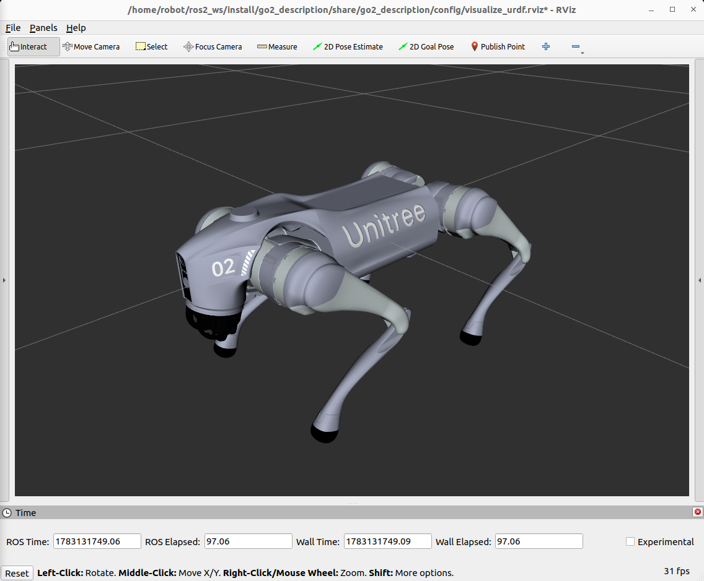
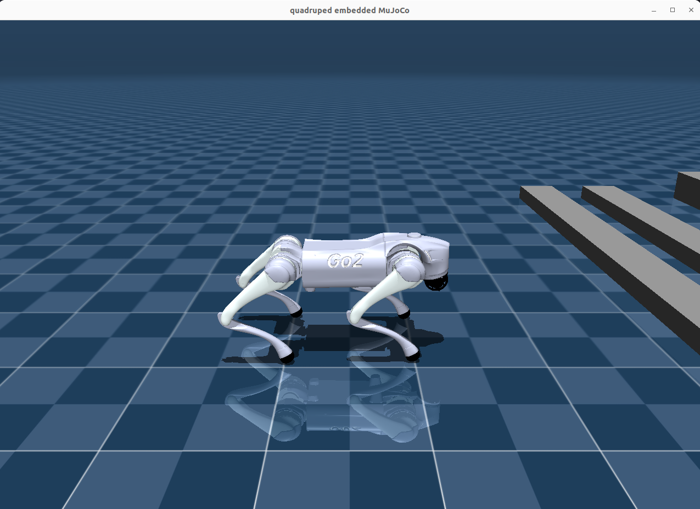

# quadruped_pkg

`quadruped_pkg` is a ROS 2 Humble quadruped-control project for the Unitree Go2 simulation. It combines a Go2 URDF/MuJoCo description, a MuJoCo-backed `ros2_control` hardware interface, a finite-state quadruped controller, Pinocchio-based kinematics/dynamics, and a centroidal-MPC trotting pipeline.

The current workflow is focused on simulation validation: bring the robot up in MuJoCo, switch between standing/free-stand/MPC trotting modes, and inspect the model in RViz and the embedded MuJoCo viewer.

<table>
  <tr>
    <td align="center"><strong>RViz</strong></td>
    <td align="center"><strong>MuJoCo Simulation</strong></td>
  </tr>
  <tr>
    <td></td>
    <td></td>
  </tr>
</table>

## Packages

- `go2_description`: Go2 URDF/Xacro model, mesh assets, MuJoCo model assets, RViz config, and `ros2_control` hardware configuration.
- `quadruped_mujoco_hardware`: MuJoCo virtual hardware plugin for `ros2_control`, including joint states, actuator torques, IMU, foot-force interfaces, odometer state, and optional embedded viewer.
- `quadruped_controller`: Main controller plugin. It includes the FSM states, Go2 Pinocchio model wrapper, gait generation, COM trajectory generation, centroidal MPC, and leg torque control.
- `quadruped_controller_msgs`: Custom input message used by the keyboard command node.
- `keyboard_input`: Terminal keyboard node that publishes `quadruped_controller_msgs/msg/Inputs` to `/control_input`.
- `third_party`: Local third-party solver dependencies used by the controller.

## Main Control States

- `PASSIVE`: Zero-torque safe state.
- `FIXEDSTAND`: Position-controlled standing state.
- `FREESTAND`: Body pose adjustment state for IK and posture checks.
- `MPC_TROTTING`: Integrated locomotion state using `ComTrajectory + CentroidalMPC + LegController`.

The old non-MPC `TROTTING` state and its legacy gait generator have been removed.

## Prerequisites

The project is developed for Ubuntu 22.04 and ROS 2 Humble.

Install common build tools and ROS dependencies:

```bash
sudo apt update
sudo apt install -y \
  git build-essential cmake \
  python3-colcon-common-extensions python3-rosdep \
  libeigen3-dev libglfw3-dev libgl1-mesa-dev \
  ros-humble-ros2-control ros-humble-ros2-controllers \
  ros-humble-controller-manager \
  ros-humble-robot-state-publisher \
  ros-humble-joint-state-publisher \
  ros-humble-joint-state-publisher-gui \
  ros-humble-imu-sensor-broadcaster \
  ros-humble-xacro ros-humble-rviz2 \
  ros-humble-pinocchio ros-humble-kdl-parser
```

External libraries:

- Install the MuJoCo C/C++ library. The default CMake path is `/opt/mujoco`, and this directory should contain `include/mujoco/mujoco.h` and `lib/libmujoco.so`.
- `OSQP` and `OsqpEigen` are already provided in `third_party/`, so no extra system installation is required for them.

## Build

Clone this repository into a clean ROS 2 workspace:

```bash
mkdir -p ~/ros2_ws/src
cd ~/ros2_ws/src
git clone https://github.com/HongjianHu/quadruped_pkg.git

cd ~/ros2_ws
source /opt/ros/humble/setup.bash

# Run this once if rosdep has not been initialized on your machine:
# sudo rosdep init
rosdep update
rosdep install --from-paths src/quadruped_pkg --ignore-src -r -y

colcon build --symlink-install --packages-up-to quadruped_controller keyboard_input
source install/setup.bash
```

If MuJoCo is not installed at `/opt/mujoco`, build with:

```bash
colcon build --symlink-install \
  --packages-up-to quadruped_controller keyboard_input \
  --cmake-args -DMUJOCO_ROOT=/path/to/mujoco
```

## Run Simulation

Start the controller, MuJoCo hardware simulation, robot state publisher, broadcasters, and RViz:

```bash
cd ~/ros2_ws
source /opt/ros/humble/setup.bash
source install/setup.bash
ros2 launch quadruped_controller mujoco_control.launch.py use_rviz:=true
```

Useful launch arguments:

- `use_rviz:=true`: Start RViz with the Go2 model.
- `use_embedded_mujoco_viewer:=true`: Start the embedded MuJoCo viewer inside the hardware interface.
- `use_mujoco_viewer:=true`: Start the standalone MuJoCo `simulate` viewer for model inspection.

Example without RViz:

```bash
ros2 launch quadruped_controller mujoco_control.launch.py use_rviz:=false
```

## Keyboard Control

Run the keyboard node in another terminal:

```bash
cd ~/ros2_ws
source /opt/ros/humble/setup.bash
source install/setup.bash
ros2 run keyboard_input keyboard_input
```

Keep this terminal focused, because it reads directly from stdin.

<table>
  <tr>
    <th>Mode keys</th>
    <th>FreeStand keys</th>
    <th>MPC keys</th>
  </tr>
  <tr>
    <td>
      <code>1</code>: <code>PASSIVE</code><br/>
      <code>2</code>: <code>FIXEDSTAND</code><br/>
      <code>4</code>: <code>FREESTAND</code><br/>
      <code>6</code>: <code>MPC_TROTTING</code>
    </td>
    <td>
      <code>A</code> / <code>D</code>: roll<br/>
      <code>W</code> / <code>S</code>: pitch<br/>
      <code>J</code> / <code>L</code>: yaw<br/>
      <code>I</code> / <code>K</code>: body height<br/>
      <code>Space</code>: reset command axes
    </td>
    <td>
      <code>A</code> / <code>D</code>: desired body-frame <code>lx</code><br/>
      <code>W</code> / <code>S</code>: desired body-frame <code>ly</code><br/>
      <code>J</code> / <code>L</code>: desired yaw rate<br/>
      <code>I</code> / <code>K</code>: desired body height<br/>
      <code>Space</code>: reset command axes
    </td>
  </tr>
</table>

## What's Next

- **More Robot Models**: extend the current description and MuJoCo hardware pipeline to support additional quadruped models.
- **Try more controllers**: build upon the current MPC framework by integrating a Whole-Body Control (WBC) layer as the lower-level torque allocation module, forming a hierarchical MPC+WBC architecture for enhanced disturbance rejection. Meanwhile, explore model-free alternatives such as Reinforcement Learning to develop adaptive locomotion policies for challenging unstructured terrains.
